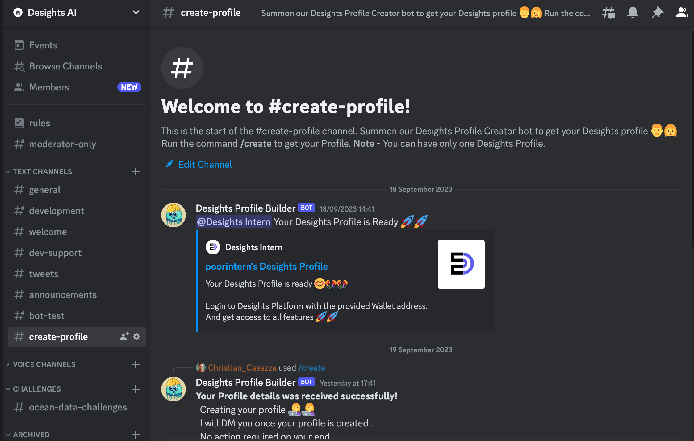

# 🦸‍♂️ Creating Desights Profile


Desights Profile is a Smart Contract Account based on ERC725 standard. Each User can have only one Desights Profile. If you have already created your Profile, you won't be able to create a duplicate profile.


### Step 1

In order to create your Desights Profile, you must join our discord server - [https://discord.gg/uBhKRmQ5H6](https://discord.com/invite/uBhKRmQ5H6)

<figure><figcaption></figcaption></figure>

### **Step 2**

Once joined, go to[ **#create-profile**](https://discord.com/channels/1032236056516509706/1153306438375047318) channel in our discord.

<figure><figcaption></figcaption></figure>

### **Step 3**

Type `/create` and press Enter to summon our **Profile Builder Bot**&#x20;

<figure><figcaption></figcaption></figure>

### **Step 4**

At this point you should see a form with 5 input fields.

<figure><figcaption></figcaption></figure>

### **Step 5**

Fill out the form with your details


**Note** - Make sure you provide the correct wallet address while creating your profile. If you don't have access to the provided wallet address, you will not be able to use your profile. And since you already created your profile you won't be able create another profile. So do pay attention in providing correct wallet address.&#x20;


<figure><figcaption></figcaption></figure>

After filling all required details, Click on **Submit**

### **Step 6**

If provided details were incorrect, or you are creating another profile (even though you already have one), you will see this error displayed

.png>)

You will also receive a DM from the bot with the reason of error&#x20;

.png>)

In my case, it errored due to duplicate profile :point\_down:

<figure><figcaption></figcaption></figure>

If you can't understand the error message and aren't able to correct the data yourself, please reach out to our discord admins and they should be able to help you.

### Step 7

If all details provided were correct, then you would see below confimation (with a nice gif)

<figure><figcaption></figcaption></figure>

At this point, you can just go off discord. Within 5 minutes, Profile Builder Bot will notify you of your Profile creation task completion in same channel like below -

<figure><figcaption></figcaption></figure>

### Step 8

Login into [https://desights.ai](https://desights.ai) with your provided Wallet address..

Congratulations :tada::tada: You now have your Desights Profile and now you can unlocked all features Desights has to offer...

<figure><figcaption></figcaption></figure>

## **And.....Welcome to Desights** :hugging::rocket:
