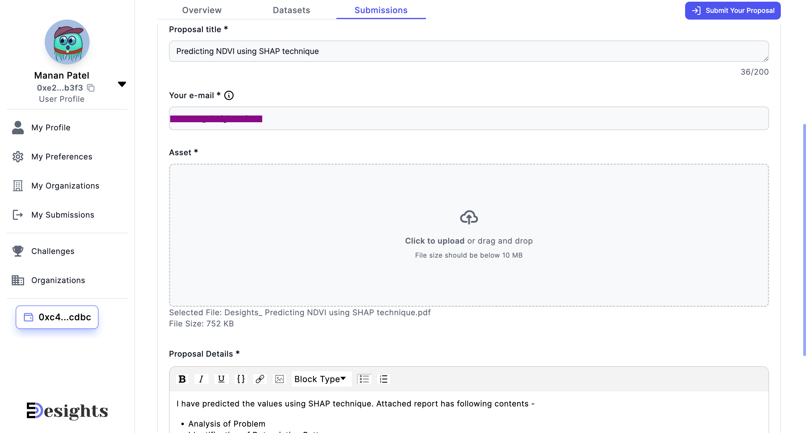

# 📥 Submission to the Challenge


### Before you Submit, make sure :point\_down:

You have a Desights Profile. If you don't have your Desights Profile yet, [check this guide](creating-desights-profile.md) to create your Desights Profile


Once you have your Desights Profile ready, let's begin the Submission process.&#x20;

### Step 1

Go to the **Challenges** tab and Click on **Challenge** you want to Submit to :point\_down:

&#x20;

<figure><figcaption></figcaption></figure>

###

### Step 2

In the right side corner across Submissions tab, click on **Submit Your Proposal** button

<figure><figcaption></figcaption></figure>

### Step 3

You should now see your Submission form (as seen in image below)

<figure><figcaption></figcaption></figure>

Fill all details for the Submission

#### Proposal Title :&#x20;

\<What this proposal is about? Avoid copy pasting Challenge title here. Title should give some idea about your submission>

#### Your e-mail :&#x20;

Your email is required so that judges can reach out to you if they have some issues/queries about your submission. If you filled in email during your Profile creation, it will appear here. You can always update your email in your Profile section. This email is not shared with anywhere else.&#x20;

#### Asset :&#x20;

This is your actual Submission. It might be a pdf file, csv file, python script, any binary AI/ML model.\


**Note** - <mark style="color:orange;">Asset file only allows to upload one file</mark>. So, If you have more than one files to Submit, make a Zip folder and upload the zip folder.&#x20;



**Important** - Currently, Desights funds your Submission uploads to Arweave to improve your user experience. Hence, to avoid miss use of funds, Desights limits the Submission file size to 10 megabytes (MB). This size limit has been carefully chosen after carefully studying median size of past submissions. So, if your submission is above this size, kindly compress the submission file before uploading.


#### Proposal Details:&#x20;

Use this section as your chance to provide more details about your submission. For (e.g.) you can mention about -

* Your assumptions
* Your Source of Data
* How should Judges use your submitted datasets or algorithms?
* Maybe some guide or tutorial etc..

### Step 4

Click on **Submit** button once all sections are filled out correctly.


**Please Note** - You can only Submit once to the challenge and cannot edit/update your submission. So make sure you get it right the first time.&#x20;


<figure><figcaption></figcaption></figure>

### Step 5

Once all transactions go through, you will see a success message

<figure><figcaption></figcaption></figure>

You can also confirm your submission by looking at **Submissions** tab. You should see your submission listed there.

<figure><figcaption></figcaption></figure>

That's it :tada::tada:&#x20;

Take a bow :raised\_hands: You have now successfully Submitted your solution :clap:&#x20;

Now we wait for the review of your Submission :trophy:
