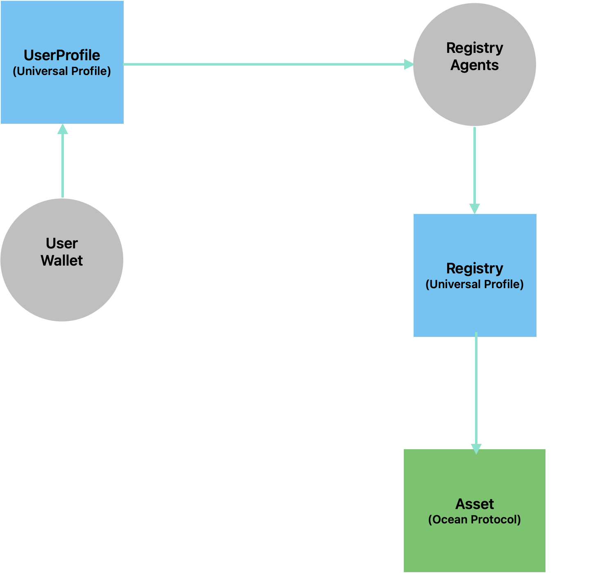
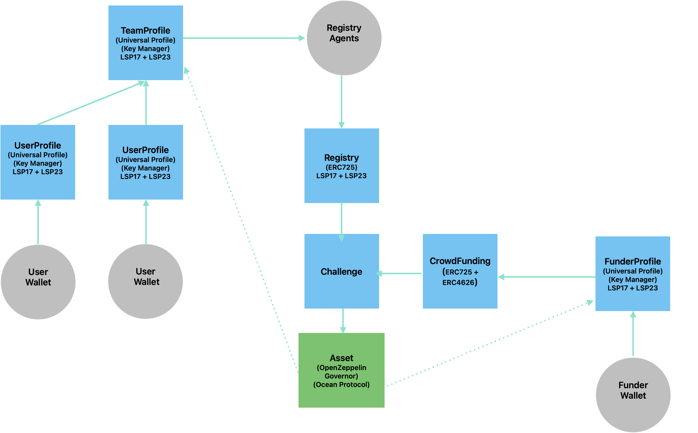

# 🏗️ Architecture

Before we begin discussing about how the architecture will evolve to accomodate our vision, let's first discuss state of current architecture

## Current Architecture

<figure><figcaption>
Current Architecture of Desights (LIVE)
</figcaption></figure>

## Upcoming Protocol Architecture

<figure><figcaption>
New Protocol Architecture
</figcaption></figure>

The architecture above show interactions between various components of Desights Protocol. Lets expand a bit more on this .

### **User Profile**&#x20;

Any individual (human or bot) operating within Desights Protocol needs to have an Account. Each Account has a Profile that contains human readable metadata of that account. Collectively we call this account + profile metadata as Profile.&#x20;

User Profile at the core is a [Universal Profile](https://docs.lukso.tech/standards/universal-profile/introduction) managed by a [Key Manager](https://docs.lukso.tech/standards/universal-profile/lsp6-key-manager) that manages usage permissions. You can think of User Profile as the onchain digital twin or any human or bot. All assets created and co-owned by the user are managed by  this User Profile. Within Desights Protocol, both [Solvers](../core-components/solvers.md) and [Funders](../core-components/funders.md) can be considered Users and are represented onchain by their User Profiles.\
\

### Team Profile

Just like User Profile, there is Team Profile. Key difference between User Profile and Team Profile is, Team Profile is co-owned and managed by multiple User Profiles. Although the underlying structure remains same, Team Profiles are much more powerful. They allow multiple owners and manages their [Ownership structure](../core-components/ownership-split.md) within a [Team](../core-components/teams.md). All [Assets](../core-components/asset.md) created by this Team shares the same Ownership Structure as defined within Team Profile. Team Profile establishes the [Collaborative](../concepts/collaborate.md) aspect of Desights Protocol.&#x20;

### Registry

Registry component is better explained [here](../core-components/registry.md)

### Challenge

Challenge is better explained [here](../core-components/challenge.md)

### Asset

Assets are better explained [here](../core-components/asset.md)
